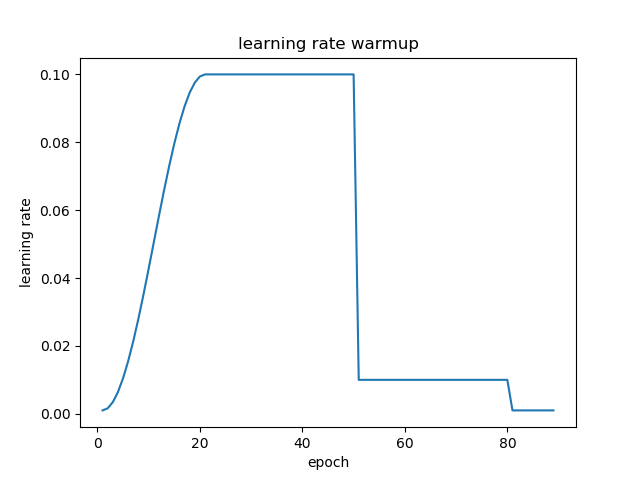

# Pytorch Scheduler wrapper support learning rate warmup

A wrapper around the Pytorch learning rate scheduler for warming up learning rate. The wrapper allows to specify the following:
* Standard interface
* Access to lr_scheduler object's attributes 
* Different strategies for warming up learning rate
* Load and save state dict



### Instalation
```
pip install git+git://github.com/lehduong/torch-warmup-lr.git
```

### Usage
Simple add a wrapper after constructing `lr_scheduler` object:

```python
optim = SGD(model, 0.1)
scheduler = StepLR(optim, step_size=10, gamma=0.1)
scheduler = WarmupLR(scheduler, init_lr=0.01, num_warmup=3, warmup_strategy='cos')
```

+ `init_lr`: learning rate will increase from this value to the initialized learning rate in optimizer (in this case 0.01 -> 0.1).
+ `num_warmup`: number of steps for warming up learning rate.
+ `warmup_strategy`: function that learning rate will gradually increase according to. Currently support **cos**, **linear**, **constant** - learning rate will be fixed and equals to *init_lr* during warm-up phase).

### Example
Below is a runnable example of `WarmupLR`:
```python
import torch
import numpy as np 
import sys
sys.path.append('..')
from torch_warmup_lr import WarmupLR
from torch.optim import SGD
from torch.optim.lr_scheduler import StepLR, ExponentialLR, MultiStepLR, ReduceLROnPlateau


if __name__ == '__main__':
    model = [torch.nn.Parameter(torch.randn(1, 1, requires_grad=True))]
    optim = SGD(model, 0.1)

    # Choose different scheduler to test
    scheduler = StepLR(optim, step_size=10, gamma=0.1)
    scheduler = MultiStepLR(optim, milestones=[3,6,9], gamma=0.1)
    scheduler = ReduceLROnPlateau(optim, threshold=0.99, mode='min', patience=2, cooldown=5)
    # wrapping the scheduler
    # strategy could be one of ['cos', 'linear', 'constant']
    scheduler = WarmupLR(scheduler, init_lr=0.01, num_warmup=3, warmup_strategy='cos')

    # this zero gradient update is needed to avoid a warning message, issue #8.
    optim.zero_grad()
    optim.step()

    # The wrapper doesn't alter wrapped scheduler interface
    # Simply plug and play
    for epoch in range(1, 20):
        # step with pseudo loss if we're using reducelronplateau
        if isinstance(scheduler._scheduler, ReduceLROnPlateau):
            pseudo_loss = 20-epoch
            scheduler.step(pseudo_loss)
            print('Epoch: {} LR: {:.3f} pseudo loss: {:.2f}'.format(epoch, optim.param_groups[0]['lr'], pseudo_loss))
        # step without any parameters
        else:
            scheduler.step()
            print(epoch, optim.param_groups[0]['lr'])
        optim.step()    # backward pass (update network)

    # get scheduler attribute
    print(lr_scheduler.cooldown_counter)
```
